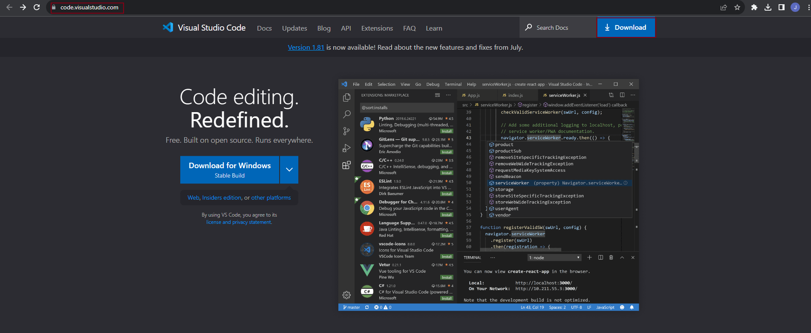

# Installing Visual Studio Code (VSCode) 

### Download and Install VSCode

- Visit the official VSCode [website](https://code.visualstudio.com/)

- Choose the appropriate version for your operating system (Windows, macOS, or Linux).

- Download the installer and run it to install VSCode.




Open VSCode:

After installation, open VSCode from your applications menu or by searching for it on your computer.

## Install the Git Extension for VSCode

GitLens is a popular extension for the Visual Studio Code (VS Code) integrated development environment (IDE). It enhances the Git integration within VS Code by providing a wide range of features and capabilities that help developers understand and navigate through their Git repositories more effectively. GitLens is developed by Eric Amodio.

- Once VSCode is open, go to the Extensions view by clicking the Extensions icon in the sidebar or using the shortcut Ctrl + Shift + X (or Cmd + Shift + X on macOS).

- Search for "Git" in the search bar.

- Install the "GitLens — Git supercharged" extension 


## Configure Git Path (Optional)

Note: The following instructions might vary slightly based on your operating system (Windows, macOS, Linux), but the general concept remains the same.

***Windows***

*** Using the Command Line***

- If you've installed Git for Windows using the official installer, the Git executable should already be in your system's PATH. You can open the Command Prompt or PowerShell and use Git commands directly.

- If the Git executable is not in your PATH, you can add it manually:
  - a Find the location where Git is installed (e.g., C:\Program Files\Git\cmd).
  - Right-click on "This PC" (or "My Computer") and select "Properties."
  - Click on "Advanced system settings" on the left. 
  - In the "System Properties" window, click the "Environment Variables" button.
  - Under "System variables," find the "Path" variable, select it, and click "Edit."
  - Add a new entry with the path to the Git executable folder (e.g., C:\Program Files\Git\cmd).
  - Click "OK" to save your changes.

## Using Git Bash

If you prefer using Git Bash, you can launch Git Bash from the start menu or desktop icon. It's a command-line interface that comes with Git for Windows.

***macOS and Linux***

Open a terminal window.

***System-Wide Configuration (All Users)***

To configure the Git path system-wide, you might need administrative privileges.
Edit the system's shell profile configuration file ***(/etc/profile, ~/.bashrc, ~/.zshrc, etc.).***

Add the following line to the configuration file, replacing /path/to/git/bin with the actual path to your Git executable directory:

```
export PATH="/path/to/git/bin:$PATH"

```
Save the file and restart your terminal or run source command to apply the changes.

***User-Specific Configuration***

- To configure the Git path for your user only, edit your user's shell profile configuration file (~/.bashrc, ~/.zshrc, etc.).
- Add the same line as mentioned above.
- Save the file and restart your terminal or run source command to apply the changes.

After making these changes, you should be able to use Git commands from any directory in your terminal. To test if it's working, simply open a new terminal window and type `git --version.` It should display the version of Git you have installed.


